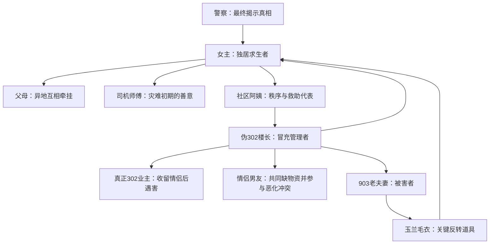

# 《末日极寒：地球之盐》剧情与人物关系梳理

> 制片人定位：这份文档不是单纯读书笔记，而是后续 AI 漫剧改编的“项目圣经”。所有剧本、分镜、角色设定、画面风格、Vidu 提示词和剪辑节奏，都应围绕这里确定的主线执行。

## 一句话概括

大年二十九，全球极寒突然降临，独居女主在回家途中察觉异常，果断放弃返乡、囤货自救；随着供暖、通信、电力逐步失效，灾难从自然威胁升级为人性威胁，女主最终识破伪装成楼长的杀人者，靠冷静、准备和克制活了下来。

## 故事类型

- 题材：末日极寒、城市求生、密闭空间悬疑、人性惊悚
- 核心卖点：普通人末日求生、极寒灾难压迫感、邻里善意与恶意反差、玉兰毛衣反转
- 情绪基调：前半段是灾难降临的紧张感，后半段是楼道悬疑和生死博弈
- 改编关键词：暴雪、人潮、囤货、帐篷、断电、猫眼、楼长、玉兰毛衣、泼水结冰

## 制片人判断

这篇小说最有商业漫剧潜力的不是“全球极寒设定”本身，而是极寒设定压缩出来的人性悬疑。灾难只是外壳，真正让观众停留的是：门外那个看似热心的楼长，到底是不是好人。

如果参赛目标是“更容易获奖”，不建议从头到尾铺完整个末日过程。短视频漫剧最怕前 1 分钟都在交代背景，观众还没进入情绪，时长就已经过半。正确做法是把世界观压缩成高压背景，把故事重心放在“伪楼长”这条人物关系线上。

### 最值得拍的核心命题

**极寒把城市冻住，但真正逼近女主的，是门外那个披着秩序外衣的人。**

这个命题同时满足三个比赛需求：

- 故事性：有清晰人物目标、悬疑铺垫、反转和高潮。
- 视觉性：暴雪、断电、猫眼、楼道、红色毛衣都有强画面。
- 创新性：不是常见“末日囤货爽文”，而是“极寒密室悬疑”。

## 改编总原则

- 主线只保留一条：女主如何识破伪楼长并活下来。
- 情绪只抓三个：冷、怕、暖。
- 人物只突出三组：女主、伪楼长、903 老太太。
- 道具只强化一个：玉兰毛衣。
- 场景尽量集中：女主家、楼道、903 家、最后墓地。
- 叙事不要贪全：火车站、父母、司机、超市都可以做背景素材，不要抢主线。

制片层面的取舍是：宁可少拍世界观，也要让观众记住“猫眼外那张脸”和“穿在凶手身上的玉兰毛衣”。

## 整体剧情梳理

### 1. 极寒降临，女主被困火车站

故事开头发生在 2024 年 2 月 8 日，大年二十九。女主原本准备回家过年，却在火车站遭遇突发暴雪和极端降温。车站外人群拥挤，列车停运，手机疯狂掉电，所有人还以为这只是一次普通的大雪延误。

随着寒冷加剧，人群开始推搡失控。女主看到前方有人被推倒，立刻意识到危险，抱起行李箱护住自己，从人群里硬挤出去，逃到天桥上。火车站的踩踏风险让她第一次意识到：灾难不仅来自天气，也来自失控的人群。

这一段的功能是建立世界危机和女主性格：她不是天生强者，但危机意识强，反应快，能在慌乱中行动。

### 2. 女主发现异常，放弃返乡转为求生

逃出火车站后，女主发现城市交通混乱、打车困难、手机电量快速下降。她看到小孩玩“泼水成冰”，立刻搜索“泼水成冰要零下多少度”，意识到气温异常。

随后，她收到家人群消息：B 市航班全部取消。她和父母通话时，父母也在商场抢购物资。女主迅速串联出三个信号：极端天气、泼水成冰、航班取消。她判断留给自己的准备时间不多，于是对司机说加两倍车费，先去户外用品店。

这一段是女主从“回家过年”转为“末日求生”的关键转折。

### 3. 女主紧急囤货，搭建室内避难点

女主先去户外用品店，购买睡袋、防寒服、卡式炉、消防斧等物资，又去药店购买暖宝宝、医疗包和基础药品。她把购买清单发到家人群，提醒家人同步准备。

司机师傅帮她把物资搬到楼下。女主一开始防备司机会抢物资，但司机只是单纯帮忙，并拒绝了她想送出的防寒服。这一幕体现灾难初期仍存在普通人的善意。

回家后，女主和父母视频通话，双方展示囤好的物资。父母准备得比她更充分，三人互相打气，约定要活到春暖花开再相见。之后女主开始改造房间：封窗缝、安装太阳能充电板、在床上支帐篷、整理食物和水源，并按照极寒条件安排物资消耗顺序。

这一段强化“女主不是重生爽文主角，而是靠现实判断和行动力求生”。

### 4. 全球极寒确认，城市秩序开始变化

女主刷到海南下雪、广东降温、B 市泼水成冰、东北暴雪等视频，意识到这不是局部天气，而是全球性极端降温。第二天醒来时，海淀区已经零下 39 度，暖气变弱，官方直播、专家访谈、居家抗寒指南刷爆全网。

女主没有选择被动等待救援，而是在大年三十晚上再次出门，冒着零下 40 度的暴风雪去附近超市补充物资。超市里的速食、防寒用品几乎被抢空，她只能拿别人不要的小型灭火器、凡士林、水龙头和少量食物。回程中，她真正感受到零下 40 度不是普通的冷，而是对身体和意志的持续摧毁。

回到家后，她睡了 10 个小时，再醒来时气温已经降到零下 52 度，供暖完全失效。

### 5. 社区自救出现，楼长制度建立

极寒之下，社区仍在试图维持秩序。此前社区阿姨曾上门组织清雪，参加者可以领取豆油和鸡蛋。女主参与清雪，看到一些老人坚持扫雪，只因为还等着儿女回家过年。这一段让故事不只是末日爽文，而带有现实情感。

后来社区阿姨再次上门，送来大米和物资，并通知小区要设楼长。由于楼内没有党员，302 住户被选为楼长。楼长的任务是每天确认住户体温、物资情况，并帮助大家互通信息。

女主对“楼长”既感到温暖，也隐隐不安。灾难面前，互助和危险会同时出现。

### 6. 伪楼长登场，悬疑线正式展开

“302 楼长”上门登记时，女主发现她比想象中年轻，脸冻得通红，拿着记事本和电子体温计。她给女主测出不靠谱的 -11.2℃，却仍然淡定记录。

女主关门后假装回卧室，又悄悄从猫眼观察。她发现楼长没有立刻离开，而是一直站在她家门外。这个行为让女主警觉起来。

之后，女主通过猫眼看到 903 老太太开门。老太太和老伴独居，儿子一家去外地过年。老太太后来送给女主小米，女主则想给她暖宝宝。老太太炫耀儿媳妇织的红色毛衣，上面绣着“玉兰”。这是后续反转最重要的伏笔。

女主开始在门口布置安全措施：菜刀、灭火器、辣椒粉、衣柜堵门。她也通过楼长的敲门习惯和聊天内容，推算楼里真实住户数量，发现楼内人数可能很少。

### 7. 断电后，人性危机爆发

大年初六，小区断电。室内温度骤降，女主把物资搬到帐篷旁边，用卡式炉烧热水取暖，但气罐只够支撑约一周。自然灾害开始进入更绝望的阶段。

这时楼长再次敲门。女主透过猫眼发现 903 的门没有关，而楼长弯腰关门时露出了里面的红色玉兰毛衣。女主立刻意识到：那是 903 老太太的毛衣。

玉兰毛衣是故事中最强的反转道具。它把温情和恐怖连接在一起：之前它代表老太太的家庭温暖，此刻却说明老太太可能已经遇害。

女主不敢出声，看到 302 关完 903 的门后又回到她家门口，把耳朵贴在门上听动静。女主意识到自己和死亡只隔着一道门。

### 8. 女主查明真相，与伪楼长正面对峙

等 302 离开后，女主冒险进入 903。她看到老两口倒在厨房，后脑的血已经冻住。她用毛衣盖住他们，短暂默哀，然后用两分钟寻找线索。

她判断两人是被人从背后袭击，说明凶手谨慎、可能没有把握正面对抗两位老人。她继续推理：为什么要先对 903 下手？为什么冒险来到 9 楼？除非楼长之前说的住户数量是假的，楼里实际没有那么多人。

就在女主推理时，302 悄悄回来了，站在她背后。女主瞬间判断对方物资匮乏、体力不如自己，于是用气势吓退她，举起菜刀大吼。对方先被吓跑，又反应过来追上楼。女主冲回家，用辣椒粉甩向楼道，暂时逼退对方。

这一段是女主从“被动害怕”转为“主动博弈”的关键。

### 9. 最终生死局：不开门，也不杀人

女主知道 302 不会放过自己，于是利用卡式炉和热水制定计划。一天后，302 果然再次出现，先跪在门外哭诉，随后拿刀砍门，要求住进女主家。

女主假装谈判，拒绝让她进门，并用“门坏了我们都得死”阻止她继续砍门。302 改口索要食物和水，女主假装答应。实际上，女主提前把化开的水倒进盆里，并在胸腹前绑好枕头防护。

当女主开门放物资时，302 飞扑过来持刀刺向她。女主把水泼到对方身上，用盆挡住攻击，并一脚把她踹下楼梯，立刻关门。极寒环境下，被水浇湿意味着极高风险，302 如果不能及时取暖，身上的冰会成为致命负担。

女主没有选择追出去补刀。她的克制非常重要，因为后文揭示凶手原本就想诱导她动手，好把罪名嫁祸给她。

### 10. 来电获救，真相揭开

女主沉睡后醒来，发现屋里灯亮了，电力恢复。社区人员带她下楼，医护人员把 302 抬上担架。女主后来进入 302 房间，看到屋内全家福上的女人根本不是她见过的“楼长”。

警察揭示真相：这个女人其实是此前清雪时女主见过的一对年轻情侣中的女孩。她和男友没有物资，原本住在 202。真正的 302 业主收留了他们，但双方因物资矛盾升级，情侣杀害了 302 业主。之后女人冒充 302 楼长，从 4 楼开始搜刮物资。7 楼业主临死前拉着男友一起跳楼，女人继续作案。

她盯上 9 楼，是因为零下 50 度下普通衣物无法保命，她需要更好的保暖资源。她原本甚至计划把罪名嫁祸给女主：让女主在她身上砍几刀，再利用女主物资充足这一点制造嫌疑。

警察告诉女主，还好她没有和对方正面动手，否则可能还要陷入正当防卫诉讼。

结尾，女主带着老太太的玉兰毛衣来到墓地，把毛衣放在老太太墓前。她认为冥冥之中是老太太守护了她，让她没有冲动杀人。最后，女主向着光明大步前行。

## 主要人物关系

## 人物卡片

### 女主

- 身份：B 市独居年轻女性，原本准备回家过年。
- 性格：谨慎、敏感、有危机意识，害怕但能行动。
- 能力：信息整合能力强，执行力强，擅长在资源有限时做取舍。
- 弱点：普通人体能有限，会恐惧、会犹豫，也会差点冲动。
- 人物弧光：从回家过年的普通人，变成在极寒和人性危机中冷静自救的幸存者。
- 改编重点：不要拍成开挂女战神，要拍成“怕得要死但仍然做正确选择”的普通人。
- 表演关键词：呼吸急促、手抖、强装镇定、低声自语、眼神快速判断。
- 造型建议：厚羽绒服、围巾、手套、居家保暖衣叠穿，后期脸色苍白、嘴唇发紫、头发略乱。
- 声音建议：旁白冷静，现场反应慌张。这样能形成“脑子清醒、身体害怕”的反差。

### 父母

- 身份：女主远在 Q 市的父母。
- 功能：体现亲情牵挂，也让女主的求生目标更明确。
- 关系：与女主分隔两地，但通过视频和物资清单互相打气。
- 改编重点：父母戏份不用多，一场视频通话足够建立情感动机。

### 司机师傅

- 身份：女主从火车站逃出后叫到的商务车司机。
- 功能：灾难初期善意的代表。
- 关键行为：帮女主搬物资，拒绝她送防寒服，说自己能和家人在一起就挺好。
- 改编重点：可以作为第 1 集或第 2 集的温情点，但不是后半段主线人物。

### 社区阿姨

- 身份：社区工作人员。
- 功能：代表灾难中仍在努力维持秩序的基层力量。
- 关键行为：组织清雪、发物资、通知楼长制度。
- 改编重点：她是“真秩序”，和后来的“伪楼长”形成对照。

### 903 老太太和老伴

- 身份：女主隔壁的老夫妻，儿子一家去外地过年。
- 功能：温情人物，也是反转牺牲者。
- 关键道具：红色玉兰毛衣。
- 关键行为：老太太送女主小米，炫耀儿媳妇织的玉兰毛衣。
- 改编重点：一定要保留玉兰毛衣伏笔。她的善意越暖，后面反转越痛。
- 表演关键词：絮叨、热心、带一点老人家的骄傲。
- 造型建议：白发、棉袄、红色毛衣，毛衣胸口或下摆有清晰玉兰花图案。
- 制片提醒：老夫妻不宜拍得过度惨烈。镜头重点放在“空屋、全家福、毛衣、凝固的血迹”这些暗示上，避免画面过重影响审核。

### 伪302楼长

- 真实身份：此前清雪时出现过的年轻情侣中的女孩。
- 伪装身份：302 住户、社区指定楼长。
- 表面形象：年轻、负责、每天敲门登记体温和物资情况。
- 真实动机：物资耗尽、停电后陷入绝境，通过杀人和搜刮求生。
- 关键行为：冒充楼长、摸清住户情况、杀害 903 老夫妻、试图进入女主家。
- 恐怖点：她不是一开始就完全疯狂，而是在极寒、缺物资和停电中逐步滑向有计划作案。
- 改编重点：前期要拍得像正常人，越正常越可怕。
- 表演关键词：前期礼貌克制，后期眼神空洞、动作僵硬、说话忽冷忽热。
- 造型建议：普通羽绒服、冻红的脸、记事本、电子体温枪；反转后露出红色玉兰毛衣。
- 声音建议：登记时语气平稳，砍门时声音发哑，谈判时突然放软，制造不可信感。
- 制片提醒：不要一登场就让她像坏人。她必须先像“秩序的一部分”，后面的反转才成立。

### 真正302业主

- 身份：原本的 302 住户，曾因孩子上学年年评优秀家长，被社区认为有责任心。
- 命运：收留缺物资的年轻情侣后，因矛盾被杀。
- 功能：解释伪楼长身份来源。
- 改编重点：如果短片时长有限，可以只在警察口述或照片反转中出现。

### 情侣男友

- 身份：伪楼长的男友，和她一起缺乏物资。
- 命运：7 楼业主临死前拉着他从窗户跳楼。
- 功能：补全凶手线索，说明作案并非女主误判。
- 改编重点：可作为背景信息，不必正面出场。

### 警察

- 身份：灾后救援和调查人员。
- 功能：揭示真相，解释女主“没有补刀”的重要性。
- 关键作用：告诉女主，伪楼长试图让她动手，以便嫁祸。
- 改编重点：结尾点到即可，不宜占太长篇幅。

## 核心人物关系

- 女主与父母：异地亲情，彼此牵挂，是女主“我要活下去”的情感动力。
- 女主与司机：短暂相遇的陌生人善意，体现灾难初期人性仍有温度。
- 女主与社区阿姨：普通居民与基层救助者，代表秩序尚未完全崩溃。
- 女主与 903 老太太：邻里善意，玉兰毛衣成为救命伏笔。
- 女主与伪楼长：猎物与猎手、怀疑者与伪装者、幸存者与掠夺者。
- 伪楼长与真正 302：被收留者反噬收留者，体现极端环境下的道德崩塌。
- 伪楼长与 903 老夫妻：借“楼长”身份降低防备，再背后袭击。
- 伪楼长与女主：她想夺取女主物资，甚至试图设计女主成为替罪羊。

## 关键道具与象征

### 玉兰毛衣

- 前期：老太太炫耀儿媳妇织的毛衣，象征家庭温暖和邻里善意。
- 中期：毛衣穿在伪楼长身上，成为女主识破真相的证据。
- 后期：女主把毛衣送到墓前，完成情感收束。
- 改编价值：这是全片最重要的视觉道具，必须保留。
- 画面要求：必须在第一次出现时给特写，第二次出现时用同构镜头让观众立刻认出来。
- 颜色策略：全片以冷蓝、灰白、暗绿为主，玉兰毛衣用红色，让它成为唯一强记忆色。
- 剪辑策略：第一次毛衣出现要温暖，第二次毛衣出现要恐怖，第三次墓前出现要释然。

### 猫眼

- 功能：制造悬疑视角，让观众和女主一起观察门外危险。
- 改编价值：适合做强视觉镜头，比如“猫眼外突然贴上一张脸”。
- 画面要求：猫眼镜头要有圆形畸变、暗角、门外楼道冷光。
- 声音策略：猫眼镜头尽量压低配乐，只留呼吸声、风声、脚步声和衣料摩擦声。

### 帐篷

- 功能：女主的室内避难所，也是末日求生视觉符号。
- 改编价值：冷蓝色屋子里的一点暖光，能形成强烈视觉对比。
- 画面要求：帐篷内用暖黄光，帐篷外用冷蓝光，形成“安全区”和“危险区”的视觉区隔。
- 制片提醒：帐篷是低成本但高辨识度场景，建议反复出现，作为女主心理安全边界。

### 卡式炉与热水

- 功能：保命资源，也是最终反制伪楼长的工具。
- 改编价值：热气、结冰、水泼人，都很适合做 AI 视频画面。
- 画面要求：热水蒸汽、盆中水面、门缝冷气要有明确特写，为最终反制做视觉铺垫。
- 安全表达：可以表现“水泼到衣服上快速结霜”的灾难效果，不必正面表现过度伤害。

### 辣椒粉、菜刀、枕头

- 功能：女主临时防身工具。
- 改编价值：体现普通人的低成本求生智慧。
- 使用原则：道具要提前出现，后面再使用。不要让关键道具突然冒出来。
- 人物表达：女主不是武力强，而是准备充分、判断快。

## 核心冲突

### 外部冲突

- 全球极寒导致交通、供暖、通信、电力逐步失效。
- 食物、防寒物资、热源成为生存核心资源。
- 楼内封闭环境让邻里关系变成潜在威胁。

### 人物冲突

- 女主想守住物资和生命。
- 伪楼长想抢夺物资、进入女主家、甚至嫁祸女主。
- 903 老夫妻的善意被伪楼长利用，形成情感冲击。

### 内心冲突

- 女主一直在“善意”和“防备”之间摇摆。
- 她害怕自己判断错，也害怕自己动作慢。
- 最关键的是，她最后控制住了补刀冲动，因此没有落入伪楼长的嫁祸陷阱。

## 最适合参赛改编的段落

最具竞争力的段落是后半段：**伪楼长杀人夺物，女主通过玉兰毛衣识破真相并自救**。

推荐截取范围：

- 从社区阿姨通知 302 成为楼长开始。
- 到 302 上门登记、猫眼贴脸、903 老太太玉兰毛衣伏笔。
- 再到断电后女主发现毛衣穿在 302 身上。
- 最后到女主设计泼水反制，来电后警察揭示真相。

这段最适合参赛，因为它同时具备：

- 完整剧情：铺垫、怀疑、反转、高潮、结尾都有。
- 人物关系：女主、伪楼长、903 老太太三方关系清晰。
- 情绪爆点：老太太善意和遇害反差强。
- 视觉爆点：猫眼、楼道、玉兰毛衣、断电、砍门、泼水结冰。
- 主题表达：极寒可怕，但人性失控更可怕；活下来不只靠勇气，也靠冷静和克制。

## 获奖向改编定位

### 项目标题建议

- 首选：《猫眼外的人》
- 备选：《玉兰毛衣》《不要开门》《零下五十二度的楼长》

首选《猫眼外的人》更适合比赛，因为它带悬疑感，观众一眼能理解“门外有人”，也能自然承接猫眼镜头这个核心视觉符号。

### 核心宣传语

**零下五十二度，最冷的不是暴雪，是门外那个自称楼长的人。**

### 参赛卖点排序

1. 悬疑反转：热心楼长其实是冒充者。
2. 情感刺痛：玉兰毛衣从温暖道具变成死亡证据。
3. 极寒视觉：断电楼道、结霜门缝、帐篷暖光、泼水成冰。
4. 女性求生：女主不是超人，而是靠观察、准备和克制活下来。
5. 主题完整：灾难考验人性，善意和恶意都被放大。

### 对标评审维度

- 故事性：用“楼长登门、玉兰反转、生死谈判”形成完整三段式。
- 技术运用：重点展示 Vidu 的暴雪、冷气、灯光变化、猫眼畸变、泼水结霜。
- 视觉呈现：统一冷蓝灾难悬疑风，用红色玉兰毛衣做记忆点。
- 创新性：把末日题材拍成楼道密室悬疑，而不是普通囤货流水账。

## 改编时建议压缩或弱化的内容

- 火车站完整踩踏段：适合作为开场背景，但如果做 3 集后半段，可以用新闻或旁白快速带过。
- 超市补货长段：能表现求生，但和伪楼长主线关系不够紧。
- 父母囤货细节：保留一场视频通话即可，不要展开太多。
- 官方直播和热搜：可用短字幕、手机弹窗、电视新闻快速交代。
- 情侣男友和真正 302 的完整过程：放到结尾警察揭示即可。

## 必须保留的戏

- 女主在帐篷里听见敲门声。
- 伪楼长第一次上门登记。
- 女主关门后从猫眼看到伪楼长还站在门外。
- 903 老太太展示玉兰毛衣。
- 断电后，伪楼长身上露出玉兰毛衣。
- 女主进入 903，确认老夫妻出事。
- 伪楼长站在女主背后。
- 伪楼长砍门，女主假装谈判。
- 女主提前绑枕头、端水盆。
- 开门瞬间，水泼出，门关上。
- 来电后，警察揭示伪楼长真实身份。
- 女主把玉兰毛衣放到墓前。

## 可以合并的戏

- 社区阿姨送物资和宣布楼长，可以合并为一场上门戏。
- 女主囤货和搭帐篷，可以用 10-15 秒蒙太奇完成。
- 父母视频和全球极寒新闻，可以合并为手机屏幕信息。
- 真正 302 业主、情侣男友、7 楼跳楼，可以由警察一句话带过。
- 墓地结尾可以缩成 5-8 秒，不要拖慢节奏。

## 参赛版故事主线建议

如果做 3 集，建议这样切：

### 第 1 集：楼长来了

极寒断电前后，女主在家搭帐篷自救。社区阿姨送来大米，并通知 302 成为楼长。伪楼长上门登记，表现得负责又诡异。女主关门后从猫眼看，发现她一直站在门外。

结尾钩子：猫眼外突然贴上一张放大的脸。

制片重点：

- 前 15 秒必须讲清楚世界观：全球极寒、断电风险、女主独居。
- 不要拍太多囤货过程，用字幕和快切蒙太奇解决。
- 第 1 集的任务不是解释全部，而是让观众觉得“这个楼长不对劲”。

### 第 2 集：玉兰毛衣

女主与 903 老太太建立邻里善意，老太太送小米并展示玉兰毛衣。断电后，伪楼长再次敲门。女主透过猫眼发现 903 门没关，而伪楼长身上穿着玉兰毛衣。她冒险进入 903，发现老夫妻遇害。转身时，伪楼长站在背后。

结尾钩子：伪楼长站在女主背后，不知道看了多久。

制片重点：

- 这一集是全片情绪核心，玉兰毛衣必须拍得清楚。
- 老太太的戏要温暖、短、准，不要煽情太久。
- 女主发现毛衣时，建议用闪回剪辑：老太太笑着展示毛衣，与伪楼长弯腰露出毛衣形成对照。

### 第 3 集：不要开门

女主逃回家，用辣椒粉暂时逼退伪楼长。伪楼长隔天砍门，要求入住。女主假装谈判，提前用枕头护住身体，用水盆反制。伪楼长扑门失败，被水浇湿。来电后警察揭示她是冒充者，并说明她试图嫁祸女主。女主带玉兰毛衣去墓前告别。

结尾画面：女主在雪后微光中向前走。

制片重点：

- 高潮不要拍成打斗片，要拍成心理战。
- 女主赢在不开门、慢开门、假答应、提前防护。
- 结尾警察解释要极短，重点落在“还好你没动手”。
- 墓前告别是情绪收束，不是新的剧情段落。

## 单集版备选方案

如果时间、算力或剪辑能力不足，可以做 1 集 2-3 分钟版本，标题仍用《猫眼外的人》。

结构建议：

- 0:00-0:20：新闻和旁白快速交代全球极寒、女主独居、楼内断电。
- 0:20-0:50：伪楼长上门登记，猫眼贴脸，建立不安。
- 0:50-1:20：903 老太太送小米，展示玉兰毛衣。
- 1:20-1:50：断电后女主发现 903 门没关，伪楼长身上露出玉兰毛衣。
- 1:50-2:20：女主进入 903，发现真相，伪楼长站在背后。
- 2:20-2:50：砍门、谈判、泼水反制。
- 2:50-3:00：来电，警察一句话揭示真相，玉兰毛衣墓前收尾。

单集版的风险是信息密度很高，优点是完成成本低。若只做一集，必须牺牲火车站、父母、司机、超市等支线。

## 视觉风格建议

### 总体风格

写实国漫、灾难悬疑、低饱和冷色。人物不要过度二次元可爱，场景要接近真实中国小区和普通出租屋。

### 色彩方案

- 室外暴雪：冷蓝、灰白、高反差。
- 楼道：暗绿、灰蓝、低照度，有压迫感。
- 女主帐篷：暖黄、橙色，代表暂时安全。
- 玉兰毛衣：红色，是全片唯一强色彩记忆点。
- 结尾墓地：雪后白光，冷中带暖。

### 镜头语言

- 火车站或新闻背景：广角、人群压迫、字幕快切。
- 女主家：近景、手部特写、呼吸白雾、物资细节。
- 猫眼：圆形畸变、暗角、突然贴脸。
- 楼道：长焦压缩空间，人物站在楼梯转角，制造未知感。
- 903 家：静态镜头，少动，越安静越恐怖。
- 最终开门：慢动作或节奏拉长，突出开门瞬间的危险。

## AI 制作风险与解决方案

- 风险：角色脸不稳定。解决：每个主要人物建立固定角色描述，服装和道具绑定身份。
- 风险：楼道场景重复单调。解决：用猫眼视角、门内视角、楼梯转角、地面低角度变化镜头。
- 风险：动作打斗容易崩。解决：少拍连续动作，多拍关键瞬间和结果镜头。
- 风险：暴力画面影响审核。解决：用暗示代替正面血腥，重点拍毛衣、门缝、脚步、女主反应。
- 风险：旁白过多变成有声小说。解决：每 10-15 秒必须有一个视觉信息点推动剧情。
- 风险：观众看不懂 302 是冒充者。解决：结尾用全家福照片和警察一句话完成确认。

## 后续制作优先级

1. 先定三集剧本，不要直接生成视频。
2. 再定角色设定，尤其是女主、伪楼长、903 老太太。
3. 再做分镜，每集控制 8-12 个镜头。
4. 先生成 5 个关键镜头测试风格：帐篷、猫眼、玉兰毛衣、楼道、泼水。
5. 风格稳定后再批量生成，不要一上来做完整片。
6. 剪辑时优先保证故事看得懂，再追求画面高级。

## 主题提炼

这篇小说表面是末日极寒求生，真正吸引人的核心是：当正常秩序被寒冷一点点冻住，人性的善与恶会同时被放大。

女主能活下来，不是因为她最强，而是因为她在每个关键节点都做了相对正确的选择：火车站逃离人群，发现异常后囤货，面对邻居保持善意但不放松警惕，发现危险后不冲动杀人，最终守住了生命和清白。

参赛改编要抓住这句话：**极寒冻住城市，善意留下温度，恶意藏在门外。**
