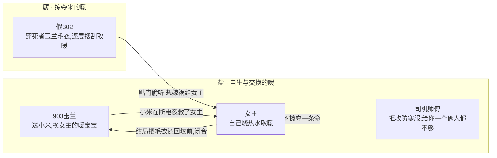

# 《地球之盐》极寒短剧改编方案

> 改编自小说《末日极寒：地球之盐》，目标形态：3 分钟/集 的 AI 短剧。
> 本文件为创作蓝本，不改动原小说 `末日极寒：地球之盐.txt` 与 `剧本修改.md`。

**已锁定参数**
- 总集数：18 集（每集 ≈3 分钟）。
- 旁白：保留第一人称内心独白（最贴短剧节奏、最易代入女主求生视角）。
- 基调：前中段冷锋利（生存惊悚 + 人性悬疑），结尾回暖（坟前归还毛衣）收束。

## 一、立意定稿（暖冷平衡）

- **片名 / 根**：保留《地球之盐》。取自圣经"你们是世上的盐"（Salt of the Earth），象征那些默默防腐、维系世界不烂掉的**平凡好人**。
- **中心命题**：`冻死人的从来不是温度，是人在恐惧里丢掉的那点"盐"`。
  盐有两面，缺一不可：
  - 不腐的**善意**——记得、给予、归还；
  - 清醒的**分寸**——自保、设防、知进退。
  > 只有善意没分寸的人，先冻死（倔老头、户外店姑娘、对邻居不设防的 903）；
  > 只有分寸没善意的人，会变成掠夺者（假 302）；
  > 两样都留住的人，才配活到来电那一天（女主）。
- **Logline（开场 / 宣发字幕，主推）**：
  `当世界冻结，活着的人和死去的人，只差一度。`
  备选：`零下五十度——生与死之间，只差一度` / `这个冬天，活人和死人，只差一度`。
  （"一度"双关：供暖系统垮在那一度；人没在那一念。）

---

## 二、贯穿全剧的主线与金线道具

### 2.1 主线：温暖从哪来——自生/归还 vs 掠夺

全剧人物按"温暖的来源"一刀切成两类，这是隐藏在生存戏底下的道德主线。



### 2.2 金线道具：玉兰毛衣（三段式）

`织着名字的炫耀 → 穿在凶手身上(物证 + 中段最大反转) → 摆回坟前(情感闭环)`

这件红毛衣是全剧最强的反转钩子与情感落点：观众看到它穿在"302"身上的瞬间，此前所有信息被迫重组。

### 2.3 "菜刀掉地"的主题化解释

女主之所以是"盐"而非凶手，区别只在一个动作：**她生产 / 归还温暖，凶手抢夺温暖。**
那一刀莫名其妙地脱手掉地，正是主题里"分寸"的具象——她终究没有用一条人命去换自己的安全感。这一念之差，事后被警察点破：救了她（免于正当防卫诉讼），也保住了她的"盐"。

### 2.4 暗副题（埋着，不点破）

坏掉的体温枪给女主测出 **-11.2℃**（仪器眼里"她已是死人"），而真正的凶手却被官方评为"优秀家长"。
**衡量"谁还活着 / 谁是好人"的标尺本身是坏的。** 留给观众回味，不靠台词解释。

---

## 三、结构装置：温度计 = 全剧倒计时时钟

每集用「温度 + 当集被剥掉的一样文明」命名，制造节拍与递进压迫感。

| 阶段 | 温度 | 被剥掉的文明 |
| --- | --- | --- |
| 开场 | -30℃ | 公共秩序（火车站踩踏） |
| 升级 | -39℃ | 独居安全感（陌生人敲门） |
| 加压 | -43℃ | 通讯 / 亲情在场（两地分隔、信号渐断） |
| 临界 | -52℃ | 供暖（暖气彻底冰凉） |
| 至暗 | 断电 | 最后的取暖手段（暖宝宝失效、燃气见底） |
| 回暖 | 来电 | —— 光重新亮起，文明回流 |

每集固定收尾在一个「钩子 / 反转 / 温度再降」上，适配 3 分钟完播 + 追更心理。

---

## 四、逐集分集表（18 集 × ≈3 分钟）

> 字段说明：温度标签 / 对应原文行段 / 3 分钟内容要点 / 结尾钩子 / 关键镜头（AI 出图·分镜提示位）。

### EP01　-30℃ · 秩序崩塌
- 原文：行 1–64
- 内容：大年二十九返乡，城市突降暴雪、气温骤降；进站口人墙越挤越密；前排传来"车全取消"的抱怨；踩踏爆发，女主抱箱撞出人潮逃上天桥。
- 钩子：劫后余生低头看手机——置顶家人群弹出截图：`B 市所有航班取消`。
- 关键镜头：阴沉天空下不见头尾的方形人墙；雪中红色羽绒服女主抱箱逆人流；天桥上回望站口的长镜头。

### EP02　信息拼图 · 倒计时开始
- 原文：行 65–97
- 内容：打车排队 200+、手机仅剩 2%；目睹小孩玩"泼水成冰"，女主搜索"泼水成冰要零下多少度"；与父母通话、决定今年不回家；把"极端天气+泼水成冰+航班取消"三条线串起。
- 钩子：女主对司机开口：`加两倍车费，先去附近最大的户外用品店`——她比所有人早一步意识到这是末日。
- 关键镜头：保温杯热水在空中划出结冰弧线；手机电量 2% 特写；车窗外彻底暗下的城市。

### EP03　抢购竞速 · 盐的第一次亮相
- 原文：行 98–146
- 内容：户外店扫货（睡袋、叠穿防寒服、卡式炉、消防斧）；劝导购姑娘也囤货（她不以为意）；外卖运力不足；赶在关门前抢药店暖宝宝与基础药。
- 钩子：司机主动把物资搬到单元门口，女主想匀一件防寒服给他，他婉拒：`你给我一个，咱俩都不够用`——主线"盐"第一次落地。
- 关键镜头：货架与购物小票特写；风雪中司机的背影被黑暗吞没、只剩远处车灯。

### EP04　两地囤货 · 彼此打气
- 原文：行 147–199
- 内容：到家暖气还热；视频里父母骄傲展示物资（还多买了生石灰、煤炭、太阳能发电机）；Q 市已 -43℃；约定"春暖花开再相见"；女主搭帐篷、堵窗缝、装太阳能板、排食物消耗优先级。
- 钩子：父母叮嘱"你一个人住，千万别掉以轻心"；女主刷到全国降温视频——这不是一城一地的事。
- 关键镜头：床上支起的帐篷+暖气贴墙；视频通话双屏物资展示；手机里全国降温短视频流。

### EP05　全网失温
- 原文：行 187–229
- 内容：通宵刷到海南下雪、广东围炉烤橘、东北跳雪堆；"在自然面前人类很渺小"，但"全人类一起面对，也就没那么怕了"；洗脸水凉透刺痛手指。
- 钩子：一觉被冻醒，-39℃；微信群刷屏——今晚专家特别直播，预约人数破两亿。
- 关键镜头：凌晨手机蓝光打在脸上；水龙头出水瞬间变凉；暖气片从"热"到"温"的手摸对比。

### EP06　敲门者
- 原文：行 230–257
- 内容：把做饭搬进卧室，电锅煮一锅方便面当晚饭，热汤驱散寒气；正暖和时，防盗门被大力敲响。
- 钩子：女主拎着电锅和菜刀贴到门口，恶声质问：`谁？`——末日里第一声对人的警惕。
- 关键镜头：电锅当碗吸面的烟火气；防盗门剧烈震动；猫眼漆黑一片的悬疑构图。

### EP07　扫雪与执念
- 原文：行 258–285
- 内容：门外是社区阿姨招募扫雪（领豆油鸡蛋）；女主加入清雪队，留守的多是等儿孙回家的老人；雪越下越大、任务被叫停，倔老头执意继续扫："孩子找不到回来的路。"
- 钩子：女主耳朵冻到痛进耳道深处，回家钻睡袋——而那些"只有暖、没有分寸"的人，正把自己留在风雪里。
- 关键镜头：风雪中佝偻的老人剪影；越扫越厚的雪；女主耳朵冻红特写。

### EP08　出门的决定
- 原文：行 286–334
- 内容：专家直播挤不进（几亿人在抢）；极寒刷爆热搜，保存"居家抗寒指南"；女主拒绝"重生爽文式"的被动等待，喊出`我要活着，我要求生，我要行动`；全副武装、兜里揣菜刀。
- 钩子：2 月 9 日大年三十晚 9 点半，-40℃，她推门走进暴风雪。
- 关键镜头：热搜词条滚屏；叠穿防寒服+N95+暖宝宝的"出征"换装蒙太奇；推开单元门灌进的白毛风。

### EP09　-52℃ · 供暖死亡
- 原文：行 335–377
- 内容：通往超市的马路一长排红色刹车灯看不到头；超市货架与模特被搬空，女主只捡到灭火器、凡士林等没人要的东西，扔下 200 块；拖麻袋逆风回家，N95 挡不住寒风。
- 钩子：瘫坐缓神后睡了 10 小时；醒来摸暖气——一片冰凉，海淀 -52℃，`供暖已经不起作用了`。
- 关键镜头：望不到头的红色刹车灯长龙；被扒光的超市模特；冰凉暖气片上的手。

### EP10　楼长登记
- 原文：行 378–401
- 内容：煎牛排时手机信号彻底中断、与世界断联；敲门来的是社区——要每栋楼出楼长，党员优先，本楼只有 302"优秀家长"合适；楼长每天确认体温与物资。
- 钩子：关上门，女主心里发紧：`灾难面前，我们真的经得住人性的考验吗？`
- 关键镜头：信号格归零；牛排油花特写；门缝里递进的社区通知。

### EP11　-11.2℃ 与猫眼
- 原文：行 402–438
- 内容：302 挨家登记，女主随口报假名"三宝"；坏体温枪给她测出 **-11.2℃**，楼长面不改色打钩；女主关门后回猫眼偷看——
- 钩子：`一张放大的脸瞬间出现在我面前`——楼长一直贴在门口没走，弯腰把耳朵贴门。
- 关键镜头：-11.2℃ 体温计读数特写；猫眼里骤然放大的脸（全剧第一个 jump scare）。

### EP12　数人头
- 原文：行 439–488
- 内容：女主推衣柜堵门、藏鞋摆刀做安全措施；从 903 老太太处得知全楼不超 10 人；推算楼内最多还有 4 人，摸清 302 敲门规律（先 02 再 01 最后 03）。
- 钩子：大年初六，本该团圆的夜里——小区断电，温度骤降，暖宝宝开始失效。
- 关键镜头：被推到客厅挡门的衣柜；纸上推演的住户分布图；断电瞬间全屋陷入黑暗。

### EP13　玉兰毛衣（中段最大爆点）
- 原文：行 489–506
- 内容：断电后卡式炉烧水、舀 903 送的小米煮粥（燃气只够撑一周）；敲门声不停，女主透猫眼看——903 的门竟开着一条缝，没关；302 弯腰去关 903 的门。
- 钩子：随弯腰动作，她中间那层毛衣露了出来——`全身的汗毛彻底炸开`。
- 关键镜头：燃气罐清点；猫眼里 302 弯腰的背影；那一抹露出的红色毛衣（定格）。

### EP14　真相浮现
- 原文：行 507–524
- 内容：闪回 903 玉兰送小米、炫耀"儿媳织的、还秀了我名字"（女主把"玉兰"认成"百合"的笑点）；此刻那件玉兰毛衣穿在 302 身上；泪一落就在脸上结冰；302 关完门，弓腰回到女主门口、把耳朵贴上来。
- 钩子：等 302 终于下楼，女主套上几层衣服，做了一个危险决定——她要进 903。
- 关键镜头：闪回暖色调的玉兰毛衣"秀名字"；冷色调里同一件毛衣穿在凶手身上的对照剪辑。

### EP15　903 的发现
- 原文：行 525–555
- 内容：女主推开 903（门被垫了石头、未关死）；老两口趴在厨房瓷砖上、后脑血已结冰；她披一件毛衣为他们送别；只给自己两分钟找线索，推理出"背后袭击=谨慎作案""断电触发了她""楼里恐怕只剩三个人"。
- 钩子：背后的风变小了，她猛地回头——`302 不知何时回来，就站在背后，不知看了多久`。
- 关键镜头：整洁屋内墙上的全家福；趴地的老两口（克制、不血腥）；女主回头与门口黑影对视。

### EP16　对峙 · 那一念
- 原文：行 556–575
- 内容：女主用半秒整理信息（对方物资匮乏、被断电逼到绝境、体力不如自己），怒目举刀大吼冲过去把 302 吓退；冲回家、抓辣椒面甩进楼道，惨叫传来；正要追击——
- 钩子：举刀的手像被谁拍了一下，刀啪嗒掉地（主题"分寸"的那一念）；等她回神，302 已经跑了。
- 关键镜头：举刀逆光大吼的女主；辣椒面在楼道扬起的红雾；菜刀坠地的清脆特写。

### EP17　泼水成冰的反杀
- 原文：行 576–620
- 内容：一天后 302 又来，跪门哭、转而砍门；女主隔门谈判，故意哭穷"天天舔冰块解渴"，砍价到只给方便面和冻水；约在 9 楼与 8 楼中间放物资。女主提前把化开的水倒进盆、胸腹绑枕头当护甲；开门刹那 302 飞扑下刀——
- 钩子：刀穿透盆底插进腹部，女主一脚把她蹬下楼梯关门；摘下被捅穿棉花的枕头，沉沉睡去，眼前浮起一抹亮光。
- 关键镜头：砍门的剁击与门后女主的脸；一盆水泼向凶手头顶（呼应"泼水成冰"）；刀尖穿盆的慢镜。

### EP18　来电与归还
- 原文：行 621–671
- 内容：来电，灯泡最大化闪亮；医护把还活着的 302 抬上担架；女主走进 302 看到**陌生的全家福**——照片里根本不是她见过的人；警方揭真相：凶手是扫雪时那对情侣里的女孩，原住 202，被 302 业主好心收留后反客为主、逐层搜刮、冒充楼长、还想把一切嫁祸女主、让她在身上砍几刀。她是全楼唯一幸存者。坏体温枪 / "优秀家长"的反讽在此回扣；那一刀掉地救了她。
- 钩子（回暖收束）：警察递来一杯热水驱散体内寒意；女主带着玉兰毛衣到 B 市郊区墓地，把毛衣摆在坟前深深鞠躬，然后向着光明大步前行。
- 关键镜头：灯泡复亮的暖光；陌生全家福的惊悚反转；坟前的玉兰毛衣与女主背影走向光明（全剧最后一帧）。

---

## 五、首尾呼应清单（剪辑时务必对齐）

- **热水**：EP02 捂热掉电手机 / EP06 一锅热汤驱寒 / EP13 断电后小米粥 / EP18 警察递来的热水"驱散体内寒意"——热水是女主"自生温暖"的贯穿物，首尾闭合。
- **玉兰毛衣**：EP14 织名炫耀（暖）→ EP13/EP14 穿在凶手身上（惊）→ EP18 摆回坟前（暖）——金线道具的三段式闭环。
- **盐 / 平凡好人**：司机（EP03）、社区阿姨（EP07）、903 玉兰（EP13–14）、女主最后的克制（EP16/EP18）——逐集点亮"盐"，结尾由片名升华主题。
- **"一度"**：开场 logline 字幕 → 温度计逐集下降 → EP16 刀掉地的"一念" → EP18 真相里"差一点就成了凶手"——双关贯穿。

## 六、片头固定字幕（每集开场 3 秒）

```
《地球之盐》
当世界冻结，活着的人和死去的人，只差一度。
```

## 七、给 AI 视频制作的统一基调备注

- 色温策略：生存惊悚段落用冷白/青灰，亲情与回暖段落（视频通话、玉兰闪回、结局）用暖橙，做明确冷暖对照。
- 视觉母题：红色（女主羽绒服 / 玉兰毛衣 / 刹车灯 / 辣椒面）作为"盐/生命"的唯一暖色锚点，在灰白世界里反复出现。
- 暴力克制：尸体、捅刺等以构图与声音暗示为主，避免直白血腥，保证平台可投放。
